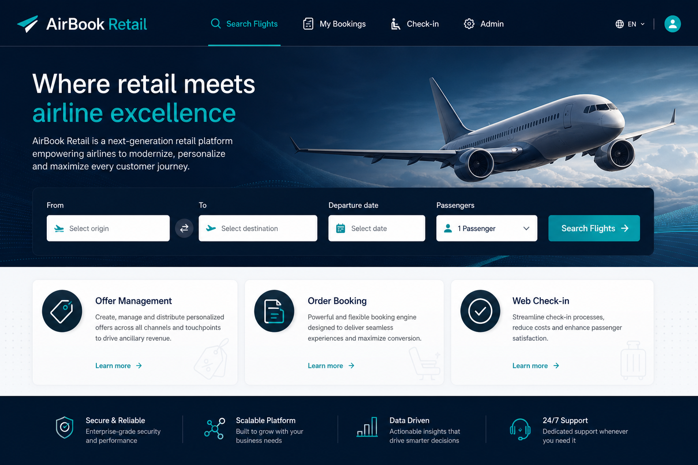
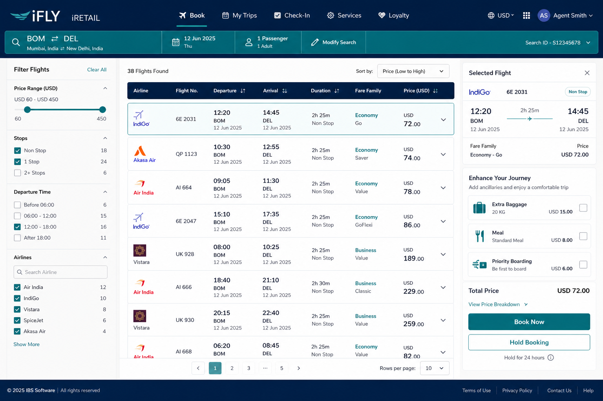
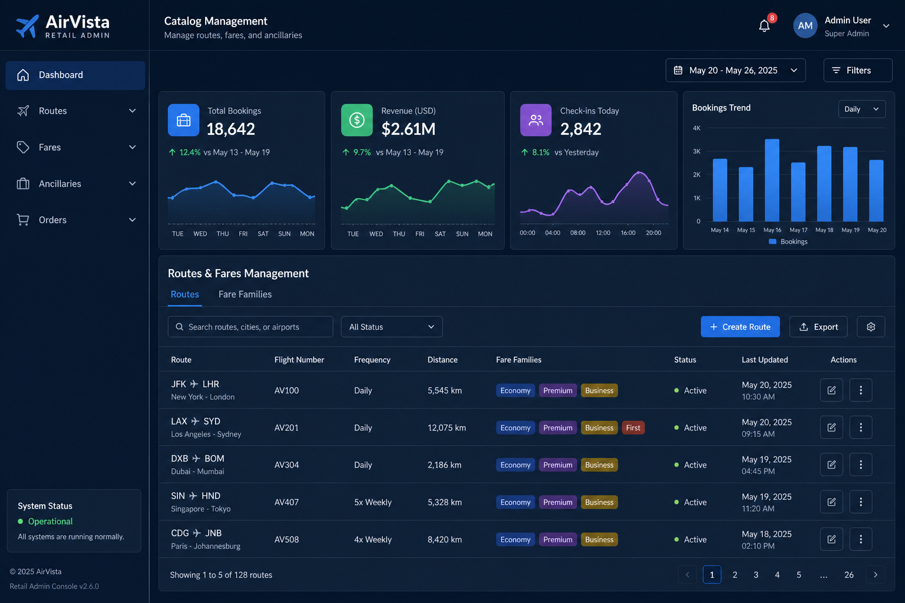

# IBS-AirBook

> Airline retail & passenger booking platform — inspired by [IBS Software](https://www.ibsplc.com/) iRetail / iFly passenger solutions (Offer–Order–Settle–Deliver).

A full-stack portfolio project demonstrating **Java Spring Boot** backend architecture and **Angular** frontend for airline retail workflows.

## Screenshots

| Home & Search | Flight Offers & Booking | Admin CMS |
|---|---|---|
|  |  |  |

## Tech Stack

| Layer | Technology |
|-------|------------|
| Backend | Java 17, Spring Boot 3.2, Spring Security, JPA/Hibernate |
| Frontend | Angular 19, TypeScript, PrimeNG, RxJS |
| Database | PostgreSQL 16 (H2 for local dev) |
| API Docs | OpenAPI / Swagger UI |
| DevOps | Docker, Docker Compose, Jenkinsfile |
| Testing | JUnit 5, Mockito |

## Architecture

Modular monolith designed for microservices extraction — mirrors IBS APS squad patterns.

```
┌──────────────────────────────────────────────────────────────┐
│                 Angular SPA (airbook-ui)                      │
│   Search · Book · Ancillaries · Check-in · Admin CMS         │
└────────────────────────────┬─────────────────────────────────┘
                             │ REST + JWT
┌────────────────────────────▼─────────────────────────────────┐
│              Spring Boot API (Modular Monolith)               │
│  ┌─────────┐ ┌─────────┐ ┌─────────┐ ┌─────────┐            │
│  │  Auth   │ │  Offer  │ │  Order  │ │ Catalog │            │
│  │ Module  │ │ Module  │ │ Module  │ │ Module  │            │
│  └─────────┘ └─────────┘ └─────────┘ └─────────┘            │
└────────────────────────────┬─────────────────────────────────┘
                             │
                    PostgreSQL / H2
```

### Domain Modules (OOSD-inspired)

- **Offer** — Flight search, fare families, branded fares, ancillary catalog
- **Order** — Booking creation, passenger details, payment summary
- **Catalog** — Admin route & fare management (CMS)
- **Auth** — JWT authentication, RBAC (ADMIN / CUSTOMER)

## Quick Start

### Prerequisites

- Java 17+
- Maven 3.9+
- Docker (optional, for PostgreSQL + frontend build)

### Run Backend

```bash
cd backend
mvn spring-boot:run
```

API: `http://localhost:8080`  
Swagger: `http://localhost:8080/swagger-ui.html`

**Demo credentials:**
- Admin: `admin@airbook.com` / `admin123`
- Customer: `customer@airbook.com` / `customer123`

### Run with Docker Compose

```bash
docker compose up --build
```

- Backend: `http://localhost:8080`
- Frontend: `http://localhost:4200`
- PostgreSQL: `localhost:5432`

### Run Frontend (requires Node 20+)

```bash
cd frontend/airbook-ui
npm install
npm start
```

## API Endpoints

| Method | Endpoint | Description |
|--------|----------|-------------|
| POST | `/api/auth/login` | JWT login |
| GET | `/api/offers/search` | Search flight offers |
| GET | `/api/offers/{id}` | Offer details |
| POST | `/api/orders` | Create booking |
| GET | `/api/orders` | List user bookings |
| POST | `/api/checkin/{ref}` | Web check-in |
| GET | `/api/catalog/routes` | Admin: list routes |
| POST | `/api/catalog/routes` | Admin: create route |
| GET | `/api/catalog/ancillaries` | List ancillaries |

## Project Structure

```
iRetail-AirBook/
├── backend/                 # Spring Boot API
│   └── src/main/java/com/ibs/airbook/
│       ├── auth/            # JWT + security
│       ├── offer/           # Flight search & offers
│       ├── order/           # Bookings & check-in
│       └── catalog/         # Admin CMS
├── frontend/
│   └── airbook-ui/          # Angular 19 SPA
│       └── src/app/
│           ├── core/        # Auth, API, guards
│           └── features/    # Home, Search, Bookings, Check-in, Admin
├── docs/screenshots/        # UI mockups
├── docker-compose.yml
├── Jenkinsfile
└── README.md
```

## CI/CD

Jenkins pipeline stages: **Build → Test → Docker Image → Deploy**

## Author

**Ganesh V** — [GitHub](https://github.com/Ganesh707-dot) · [LinkedIn](https://linkedin.com/in/ganesh-v-2564bb21a)

Built as a portfolio project targeting airline retail / PSS domain (IBS Software APS).
